# 🌟 Soft Vision Technologies (Pvt) Ltd

<div align="center">


### 🚀 **Innovative Solutions. Tailored for Your Success.**

*A rapidly expanding Sri Lankan software powerhouse delivering cutting-edge digital solutions*

[](http://www.softvision.lk)
[](mailto:info@softvision.lk)
[](https://maps.google.com/sri-lanka)
[](https://linkedin.com/company/soft-vision-technologies-pvt-ltd)

---

</div>

## 📊 Company Statistics

<div align="center">

| 🎯 **Projects Delivered** | 👥 **Happy Clients** | 🏛️ **Government Projects** | 
|:-------------------------:|:--------------------------:|
| **50+** | **40+** | **15+** |

</div>

<details>
<summary>📈 <strong>View Detailed Analytics</strong></summary>

```
📊 Project Distribution:
████████████████████████████████████████ 100% Total Projects (50+)
███████████████████████████████████      85%  Web Applications
██████████████████████████████████       80%  Mobile Applications  
████████████████████████████             70%  Desktop Applications
███████████████████████                  60%  AI/ML Solutions
████████████████████                     55%  Government Solutions
██████████████████                       50%  Enterprise Systems

🌍 Client Base:
██████████████████████████████████████   90%  Private Sector
█████████████████████                    50%  Government Sector
████████████████                         40%  International Clients
```

</details>

---

## 🎨 **What We Do**

<div align="center">


</div>

### 🌐 **Our Services**

| Service | Description | Technologies |
|---------|-------------|--------------|
| 🎯 **Custom Software Development** | Tailored solutions for your unique business needs | Full-stack development with modern frameworks |
| 📱 **Mobile App Development** | Native and cross-platform mobile applications | React Native, Flutter, Ionic |
| 🖥️ **Web Application Development** | Responsive, scalable web solutions | React, Vue.js, Angular, Node.js |
| 🤖 **AI & Machine Learning** | Intelligent solutions powered by AI/ML | Python, TensorFlow, PyTorch |
| ☁️ **Cloud Solutions** | Scalable cloud-native applications | AWS, Azure, Google Cloud |
| 💼 **Enterprise Solutions** | Large-scale business applications | Java Spring, .NET, Microservices |

---

## 💻 **Technology Stack**

<div align="center">

### **Frontend Technologies**


### **Backend Technologies**


### **Frameworks & Libraries**


### **Mobile Development**


### **Desktop Development**


### **AI & Machine Learning**


### **Databases**


### **Cloud & DevOps**


</div>

---

## 🏆 **Our Achievements**

<div align="center">

| Achievement | Count | Description |
|-------------|-------|-------------|
| 🎯 **Successfully Delivered Projects** | **50+** | Custom software solutions across various industries |
| 🏛️ **Government Partnerships** | **15+** | Trusted by Sri Lankan government institutions |
| 👥 **Satisfied Clients** | **40+** | Long-term partnerships with businesses |
| 🌟 **Industry Recognition** | **Multiple** | Awards for innovation and excellence |
| 📈 **Client Retention Rate** | **95%** | Exceptional service quality and support |

</div>

---

## 🎯 **Project Categories**

<details>
<summary>🏛️ <strong>Government Projects</strong></summary>

### **Public Sector Solutions**
- **E-Government Platforms** - Digital transformation of government services
- **Public Management Systems** - Efficient resource and data management
- **Citizen Service Portals** - User-friendly interfaces for public services
- **Administrative Dashboards** - Real-time monitoring and reporting systems
- **Document Management Systems** - Secure and organized file handling

</details>

<details>
<summary>🏢 <strong>Enterprise Solutions</strong></summary>

### **Business Applications**
- **ERP Systems** - Comprehensive business resource planning
- **CRM Platforms** - Customer relationship management solutions
- **Inventory Management** - Real-time stock and supply chain tracking
- **Financial Management Systems** - Accounting and financial reporting
- **HR Management Platforms** - Employee lifecycle management

</details>

<details>
<summary>🚀 <strong>Startup Solutions</strong></summary>

### **Innovative Applications**
- **MVP Development** - Rapid prototyping and minimum viable products
- **SaaS Platforms** - Software as a Service solutions
- **Mobile-First Applications** - Modern, responsive mobile experiences
- **AI-Powered Solutions** - Machine learning integrated applications
- **E-Commerce Platforms** - Complete online selling solutions

</details>

---

## 🌟 **Why Choose Soft Vision Technologies?**

<div align="center">

```
┌─────────────────────────────────────────────────────────────┐
│                    🚀 OUR CORE STRENGTHS                   │
├─────────────────────────────────────────────────────────────┤
│  ✅ 8+ Years of Industry Experience                       │
│  ✅ 50+ Successful Project Deliveries                     │
│  ✅ Expert Team of Certified Developers                   │
│  ✅ Agile Development Methodology                          │
│  ✅ 24/7 Technical Support & Maintenance                  │
│  ✅ Competitive Pricing with No Hidden Costs              │
│  ✅ On-Time Delivery Guarantee                            │
│  ✅ Cutting-Edge Technology Integration                    │
└─────────────────────────────────────────────────────────────┘
```

</div>

### **🎨 Our Development Process**

```mermaid
flowchart LR
    A[📋 Requirements Analysis] --> B[🎨 Design & Planning]
    B --> C[⚡ Development & Coding]
    C --> D[🧪 Testing & Quality Assurance]
    D --> E[🚀 Deployment & Launch]
    E --> F[🛠️ Maintenance & Support]
    
    style A fill:#e1f5fe
    style B fill:#f3e5f5
    style C fill:#e8f5e8
    style D fill:#fff3e0
    style E fill:#fce4ec
    style F fill:#f1f8e9
```



---

## 📞 **Get In Touch**

<div align="center">

### **Let's Build Something Amazing Together!**

| Contact Method | Details |
|----------------|---------|
| 🌐 **Website** | [www.softvision.lk](http://www.softvision.lk) |
| 📧 **Email** | [info@softvision.lk](mailto:info@softvision.lk) |
| 💼 **LinkedIn** | [Soft Vision Technologies](https://linkedin.com/company/soft-vision-technologies-pvt-ltd) |
| 📍 **Location** | Sri Lanka 🇱🇰 |

### **Business Inquiries Welcome**
*Ready to transform your ideas into powerful digital solutions? Contact us today!*

[](mailto:info@softvision.lk)

</div>

---

<div align="center">

### **🌟 Innovative Solutions. Tailored for Your Success. 🌟**

*Crafting tomorrow's technology today*

---

**© 2024 Soft Vision Technologies (Pvt) Ltd. All Rights Reserved.**

*Built with ❤️ in Sri Lanka*


</div>